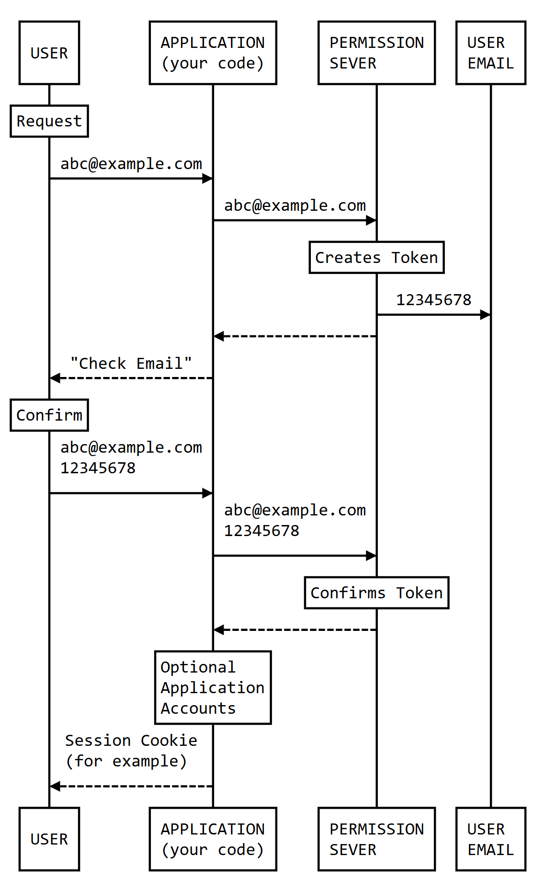

# PERMISSION-SERVER

DotNet Nuget package providing password-less authentication with auto-expiring tokens (in an in-memory store; no database required) and confirmation emails.

Add email-based sign-up/login to your site/app with minimal effort!

[The Nuget package is available here](https://www.nuget.org/packages/Permission-Server).

*Licensed under the [AGPL](./LICENSE.txt), you are free to use Permission Server in any project whether open source, free, or commercial. For further details [see here](./LICENSE.txt).*

*Copyright 2024 K Cartlidge.*

---

## Contents

[General](#general)

- [Features](#features)
- [Overview](#overview)
- [Concerns](#concerns)
- [License](#license)
- [Changelog](./CHANGELOG.md)

[Using Permission Server in your code](#using-permission-server-in-your-code)
  - [Flow diagram](#flow-diagram)
  - [Registering Permission Server into your application's dependency container](#registering-permission-server-into-your-applications-dependency-container)
  - [Issuing and confirming an email address via an emailed token](#issuing-and-confirming-an-email-address-via-an-emailed-token)

[About the sample MVC site](#about-the-sample-mvc-site)

---

## General

### Features

- Email address confirmation
  - Suitable for account creation or login
- Auto-expiring tokens (configurable lifetime)
- Multiple active tokens in case of email issues
  - Maximum active per email is configurable
- Optional context to deter token stealing
  - Compares your own context during confirmation flow
  - EG using a session id ensures the same browser session
- Minimal supporting code required
- No database needed

### Overview

The hardest details to steal from your systems are those that you never stored in the first place. With Permission Server you get the reassurance of confirmed email addresses for both account creation and login, but without the need to store passwords, security questions, or other high-value data.

Reduce your risk and, for many apps/sites, your overheads too due to the ability to skip a database.

#### How does it work?

- Your app/site asks for an email address
- Permission Server generates a token and emails it to the user
  - The user signs into their email (which means the email provider is indirectly applying security *for* you)
  - The user reads your email, copies the token, and clicks a link back to your site
- Your app/site has a confirmation screen/page asking for the email address and token
- Permission Server validates the token is a match and has not expired
  - Having the token from the email account proves email address access
  - An optional context (eg session id) can be added when sending and checked upon confirmation
  - Your app/site is now safe to either create an account or sign the user in

#### For personal sites

You may be writing your own blog or content site and want editing features.
To allow this you need some kind of authentication to enable access to an admin area.

As you don't need passwords you're free to store a list of admin email addresses in your appsettings file (for example).  Your login screen takes an email address and checks it against that allow-list.  If it's supported it emails a token.  By accessing that token in your email you prove who you are and can enter the admin area.

#### For larger sites

You'll probably have a database already, but there's no need to risk data loss by adding any password or recovery details into it; your database is unchanged.

When a user confirms their email address via Permission Server you either sign them into their account (which exists in your database with a matching email address) or you take them through account creation based on that email address knowing that they have proven control of it.

### Concerns

#### What's the downside of storing tokens in memory?

There *is* a downside. How important it *really* is to you depends upon your business, your site reliability, and your release frequency.

Before saying more let me first remind you that not having a database:

- Reduces server requirements
- Provides simpler deployments
- Increases performance
- Eliminates database management
- Removes a data source for hackers

The downside is that active tokens are lost whenever your app/site dies, is restarted, or has a new release. This means those tokens will not work.

However there are mitigating factors:

- A stable app/site should rarely be down
- If it *is* down your users can't use it anyway so your tokens are irrelevant
- If it's down for more than your token lifetime (which is measured in minutes) then those tokens would have expired anyway
- You probably advised of a maintenance window
- Existing sessions will be maintained if you are using session cookies or similar; only token confirmations are affected
- Users can simply request another token (try again)

For the vast majority of cases these mitigations mean that the benefits of no database outweigh any concerns.

There is also the secondary downside of tokens consuming app/site memory as they are not stored in an external file or database. However volumes are usually very low (relating directly to the amount of users confirming tokens not the amount of users on the site), and all used or expired tokens are automatically removed every time a new token is generated. Token growth is therefore limited to the window of your token lifetime.

Database support is a planned future feature if you still need it, so watch this space.

#### What if the user's email is compromised?

We're relying on users reading a token in an email to confirm access.  If their email is compromised that opens up access to the token and therefore any apps/sites protected by Permission Server.

However *this is exactly the same risk as a typical password-based system*.

Why?  A password-based system generally has a forgotten or reset password feature.  This works via their emails, which means if their email account has been compromised they are equally at risk as that's now working as a password-less system in that they get to set/reset their password based on their ability to access the recovery email.

The only real extra protection is two-factor/multi-factor (eg SMS or TOTP codes) which you are free to add to a password-less system just as you would a password-based one; it requires the same amount of effort regardless.

One extra step Permission Server offers is the use of an optional `context` both when starting and when confirming the email address.  If a context is added at the start then the same context *must* be provided at the end to complete confirmation.

By choosing what context your code will pass in you choose the level of granularity for protecting the confirmation flow. If you provide the current session id then for the same user it will be the same at both ends and confirmation will succeed. If the email is hacked and somebody else tries to use the token it will fail as their session will differ.

In the same way you could limit it to the same browser using browser fingerprinting or the same network using IP address. If you have nothing else specific enough you can use something like a guid stored in a secure cookie; if you don't have the cookie you can't use the token because you won't have the cookie-backed guid.

### License

*Being licensed under the [AGPL](./LICENSE.txt) you are free to use Permission Server in any project whether open source, free, or commercial. For further details [see here](./LICENSE.txt).*

- If you are just *using* Permission Server within a larger project you're fine
- If you *change* Permission Server or offer it wrapped up as a *networked service* (eg as a cloud offering) then you need to read the license

---

## Using Permission Server in your code

The publicly available methods and models are kept deliberately simple. After all, one of the main reasons you might choose to use Permission Server is to avoid all the complexity that comes with a full user management system.

In essence you have a class for interacting with tokens and emails, a class for options, and an extention method to help you register it all.

*There is also a sample MVC website in the Permission Server source code repository.*

### Flow diagram

The [mermaid source for this diagram](./flow.mermaid) is in this repository.

*You'll see by looking at the column labelled `APPLICATION` that your code has very little work to do, mostly comprising passing information between your user and Permission Server*.

The exception is that *optionally* you can maintain your own application-level accounts system to apply further restrictions safe in the knowledge the user has confirmed the email address.



### Registering Permission Server into your application's dependency container

The below code configures and registers Permission Server and it's dependencies so you can then inject it into your controllers or services as required.  This uses an extention method on `IServiceCollection`.  In the background it also sets up its token store and emailing system.

`Program.cs`

``` csharp
using static PermissionServer.PermissionServerOptions;
// ...
public static void Main(string[] args)
{
    // ...
    var options = new PermissionServerOptions
    {
        Tokens = new TokenOptions
        {
            Length = 8,
            LifetimeMinutes = 15,
            SingleUse = true,
            MaximumActivePerKey = 5,
        },
        Emails = new EmailOptions
        {
            Hostname = "smtp.email-provider.com",
            Port = 587,
            StartTLS = true,
            Username = "email-account-username",
            Password = "email-account-password",

            AppName = "Sample App",
            Sender = "Sample App <no-reply@email-provider.com>",
            Subject = "{AppName} email confirmation",
            Body =
                "To confirm this email please visit:  {URL}\n" +
                "Once there enter confirmation code:  {ConfirmationCode}\n\n" +
                "This code is valid for {LifetimeMinutes} minutes from when the email was issued.\n" +
                "Sent to {Recipient} and valid until {ValidUntil} (UTC/GMT). " +
                "If this was not requested you may safely ignore this email.",
        },
    };

    builder.Services.AddPermissionServer(options);
    // ...
}
```

Note that the `Subject` and `Body` in the configuration above are templates which can include placeholders. Those placeholders are enclosed in curly braces (`{placeholder}`) and are substituted with the related values as emails are being generated.

| Placeholder | Value |
| ----------- | ----- |
| `{AppName}` | The `AppName` provided during configuration |
| `{Recipient}` | The full recipient of the email address (eg `dave <dave@example.com>`) |
| `{ConfirmationCode}` | The generated confirmation code for the user to enter |
| `{LifetimeMinutes}` | How many minutes the confirmation code is valid for |
| `{ValidUntil}` | When the confirmation code expires (in UTC/GMT not local time) |
| `{URL}` | Where your app expects the user to enter the confirmation code |

### Issuing and confirming an email address via an emailed token

- Your code needs to provide Permission Server an email address and the URL that the email directs the user to. In the background a token will be generated and a confirmation request email sent.
- When the user clicks that link and comes back into your code you then need to pass Permission Server the email address plus the confirmation code that the user obtains from within their confirmation email. Permission Server will then confirm that the confirmation code is one that is correct, current, and issued for that email address.
- With just two methods you've got proof that the user has access to the email address, leaving you free to either create an account or sign them in to an existing one based on that confirmation.
  - By using the `context` as described in the 'concerns' section above you gain extra confidence

`AccountController.cs` (for example)

``` csharp
using PermissionServer;
// ...
private readonly PermissionServer.PermissionServer permissionServer;

public AccountController(PermissionServer.PermissionServer permissionServer)
{
    this.permissionServer = permissionServer;
}

[HttpGet]
[Route("/login")]
public IActionResult Login() => View();

[HttpPost]
[Route("/send-confirmation")]
public async Task<IActionResult> SendConfirmation(LoginRequest model)
{
    // ...
    // The context below is optional.
    var context = HttpContext.Connection.RemoteIpAddress?.ToString() ?? "";
    var confirmUrl = $"{Request.Scheme}://{Request.Host}/{nameof(Confirm)}";
    var added = await permissionServer.StartConfirmation(model.EmailAddress, confirmUrl, context);
    if (added)
    {
        // A token was created and the user has been emailed the confirmation code.
    } else {
        // If no token was added then the MaximumActivePerKey has been reached.
        // The user is trying too often and needs to wait for their oldest active
        // attempt to expire before they get another go.
        // It may also be the case that sending the email failed. We do not get
        // a separate error as advising the user which it is can be a security risk.
    }
    // ...
}

[HttpGet]
[Route("/confirm")]
public IActionResult Confirm() => View();

[HttpPost]
[Route("/confirm")]
public async Task<IActionResult> ConfirmPost(ConfirmationRequest model)
{
    // ...
    // The context below is optional.
    var context = HttpContext.Connection.RemoteIpAddress?.ToString() ?? "";
    var matched = permissionServer.CompleteConfirmation(model.EmailAddress, model.ConfirmationCode, context);
    if (matched)
    {
        // Email account access has been confirmed.
    } else {
        // There was an issue with the confirmation.
        // It may be incorrect, expired, or already used.
    }
    // ...
}
```

You should add data annotations to your POST models and check the ModelState. Permission Server verifies tokens but beyond that there are no checks; the first you'll know about a bad email address for example is when it fails to send.

Here are the example models used above:

``` csharp
using System.ComponentModel.DataAnnotations;

namespace Models.RequestModels
{
    public class LoginRequest
    {
        [Required(ErrorMessage = "You must enter an email address.")]
        [StringLength(200, MinimumLength = 6, ErrorMessage = "The email address must be between 6 and 200 characters.")]
        public string EmailAddress { get; set; } = "";
    }

    public class ConfirmationRequest
    {
        [Required(ErrorMessage = "You must enter an email address.")]
        [StringLength(200, MinimumLength = 6, ErrorMessage = "The email address must be between 6 and 200 characters.")]
        public string EmailAddress { get; set; } = "";

        [Required(ErrorMessage = "A confirmation code is required - check your email and try again.")]
        [StringLength(64, MinimumLength = 5, ErrorMessage = "The confirmation code is not in the expected format - check your email and try again.")]
        public string ConfirmationCode { get; set; } = "";
    }
}
```

For more complete details see the sample MVC site.

## About the sample MVC site

> You will need to add email server credentials to `Program.cs` first.
Complete ALL the fields saying `[FILL ME IN]`.
The other settings are already suitable for a free email service for developers that's designed for just this type of thing.

> For this example (and most sites using Permission Server) there is no need to create an account. Logging in confirms the email address so an account can be transparently created in the background, meaning sign-up and login are the same thing (though you may choose to have different flows in your UI for user clarity).

The most common scenario is an MVC website, so there's an example in the Permission Server source code repository.
Here's a few pointers on where to look and what to look for.

*You should read the following with the sample site code also open.*

**Permission Server is registered in the `Program.cs` file.**

In there you'll see the configuration and registration as mentioned higher up.  What you'll also see is it **switches on cookie-based session authentication**.  This provides automatic support for the `[Authorize]` attribute on controller endpoints (provided you sign the user in/out within your controllers etc).

It also sets the `LoginPath` in the cookie config. By default dotnet redirects unauthenticated users visiting protected pages to `/account/login`, but I prefer the simpler `/login` route instead and this option updates the cookie authentication flow accordingly.

**Signing in and out via emailed confirmation codes is done in the `Controllers/AccountController.cs` file.**

The constructor asks for an injected instance of the `PermissionServer` class.
There are two main aspects - providing the user with a token and then confirming it later on.  Each aspect has a GET and a POST where the GETs (`Login` and `Confirm`) present a view to gather information and the POSTs (`SendConfirmation` and `ConfirmPost`) make use of that information.

The `SendConfirmation` endpoint is given an email address by the user. It composes a confirmation URL and gets Permission Server to generate the confirmation code and email it out.  It also signs the user out (personal preference; this is optional).

The `ConfirmPost` endpoint is again given an email address by the user but this time accompanied by the confirmation code obtained by reading that email.  If everything matches the user is signed in.  There are example claims added in at that point but obviously that's entirely down to you and how your application works.

Both `SendConfirmation` and `ConfirmPost` use the optional `context` parameter when calling Permission Server to restrict the token confirmation step to users who share the same context given during the initial send step.

For completeness there's a `Logout` endpoint too but that's a concern of the application itself and nothing to do with Permission Server.

**Suitable views exist within `Views/Account` for starting and finishing the confirmation flow**

These views are for the `AccountController` endpoints just described.  They are simple and obvious, and are nothing to do with Permission Server itself. They either show the forms for taking the user login/confirm input, or they display the outcome of processing that input.

**The `Views/Shared/_Layout.cshtml` site layout has been updated**

Again, this is nothing to do with Permission Server itself but is included in case it's helpful.
At the top of the view the current user and login status is assessed.
In the navigation area the menu links are shown or hidden accordingly.
And in the `<main>` area the currently signed-in user is shown before the content is rendered.

**A stub `Views/Home/Dashboard` page has been added to show a protected page in use**

This involves a new endpoint in `Controllers/HomeController.cs` and a related `Views/Home/Dashboard.cshtml`.  Both are virtually empty; the only point is to show the `[Authorize]` attribute protecting the page.

---

*Please do not open the `.editorconfig` file in the Visual Studio UI as there is a likelihood it will become filled with VS-specific entries.*
